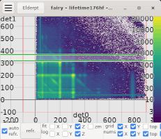
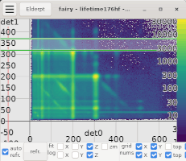
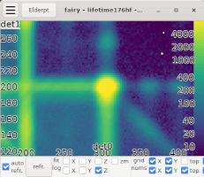
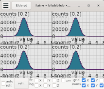

# FAIRY - flexible analysis of irradiation yields

Fairy is a light-weight data visualization and analysis tool. It is meant to be used with the [Elder](https://git.gsi.de/eel-software/elder/elderpt) data analysis framework.

The Design goals of fairy were:
  - quick response in interactive use 
  - fast update rates
  - intuitive interface
  - few dependencies (e.g. fairy does not use Root)

Features are:
  - 1D/2D histograms 
  - 1D/2D window gates and 2D polygon gates
  - 1D functions and interactive fitting to histogram data
  - interactive projections of 2D histograms

The program is written in the D programming language. The GUI is currently based on GTK3 and Cairo.

## User Manual

fairy manages multiple data windows. Each window is separated into 
  - a tree-view of all available items, 
  - a canvas where items are visualized,
  - and below the canvas is a control panel.

When a check box in the tree-view is clicked, the current status of the item will be shown. 
If the check box is a directory with multiple items, all items will be shown.
If the item is a histogram which is changing because data is analyzed, the canvas will show the state of the histogram when the check box was clicked.
Pressing the "refr." button in the control panel will update the drawing of the histogram once.
In "auto refr." mode, the drawing of all items will be updated repeatedly as fast as possible.

Each window can display data (1D/2D histograms, 1D/2D gates, 1D functions) in tree modes
 - overlay mode: all data is drawn on top of each other
 - row-major mode: dat

## mouse navigation in canvas

### translation
 

Translations can be done by click and hold on the canvas with the middle mouse button. 
Moving the mouse while holding the middle mouse button down will keep the clicked point under the mouse cursor, even if the mouse leaves the window.

### scaling (zooming)

By click and hold the canvas with the right mouse button the canvas can be scaled around the point that was clicked. 
Moving the mouse while hoding the right mouse button will keep the clicked point at a fixed position.
Moving the in the x-axis to the left/right while hodling the right mouse button down will zoom/unzoom in x-direction around the clicked point unless "x-fit" mode is active.
Moving the in the y-axis up/down while hodling the right mouse button down will zoom/unzoom in y-direction around the clicked point unless "y-fit" mode is active.

### color bar manipulation

Color bar translation and zoom work in exactly the same way as the for the x- and y-axis with middle and right mouse buttons, only the click point has to be within the color bar.

### canvas navigation in tiling mode with multiple items

In tiling mode, the canvas navigation with the mouse works exactly the same as with one item or in overlay mode.
All tiles share the same boundaries unless "x-fit" mode or "y-fit" mode are acitve. 
If "x-fit" mode is active each tile will scale and translate the x-axis such that the x-bounding-box of the item is fully contained. 
If "y-fit" mode is active each tile will scale and translate the y-axis such that the y-bounding-box of the item is fully contained. 
If "z-fit" mode is active each tile will scale and translate the color bar such that the z-bounding-box of the item is fully covered by the colorbar. 

### interactive items
Interactive items (1D-windows, 2D-windows, polygon gates) can be manipulated with the left mouse button. 
Elements of interactive items are 
 - left/right border of a 1D-Window
 - points of a polygon gate

Hovering the mouse over an element of an interactive item will highligh that element in green.
A single left click on an element of an interactive item will select only that element and deselect all previously selected elements.
A single left click into the void will deselect all selected elelments.
Holding Ctrl while left clicking an unselected/selected element will add/remove that element to/from the set of selected elements.
Left click and hold will open a selection box. When releasing the left mouse button, all elements inside the box will be added/removed to/from the set of selected elelments if the Shift key is inactive/pressed. 
Click and hold any highlighted or selected element will allow to move all highlighted and selected elements together with the mouse unless a selected element is in a different tile in grid mode then where the mouse click happened.
If elments of different items should be moved together, this should be done in overlay mode.

#### polygon gates

Polygon gates have a richer set of actions than 1D/2D-windows.
 - Line segments can be split by left click on the line while the Shift key is pressed. 
 - A point can be deleted by left click on the point while the Shift key is pressed.
 - The entire polygon can be scaled/rotated around its center by a left click an hold into the polygon area while the Shift/Ctrl key is pressed.

## keyboard shortcuts

| key      | action                                                                        |
|----------|-------------------------------------------------------------------------------|
| Ctrl-n   | open new window                                                               |
| Ctrl-w   | close window                                                                  |
| Ctrl-q   | quit program                                                                  |
|   u      | update content                                                                |
|   p      | toggle poll mode (aka auto update)                                            |
|   f      | fit viewport to content                                                       |
|   x      | toggle auto fit mode on x axis                                                |
|   y      | toggle auto fit mode on y axis                                                |
|   z      | toggle auto fit mode on z axis                                                |
|   l      | toggle logscale mode (affects y or z axis)                                    |
|   g      | toggle grid                                                                   |
|   i      | toggle fill mode for 1D histograms                                            |
|   t      | toggle statistics display for 1D histograms                                   |
|   m      | toggle zoom mode (only filled bins are considered when fitting the viewport)  |
|   o      | overlay mode (no tiling, all histograms are drawn on top of each other)       |
|   r      | row-major mode                                                                |
|   c      | column-major mode                                                             |
| 1...9    | set number of rows/columns in row-/column-major mode                          |
|   b      | toggle color bar                                                              |
| a,s,d,w  | navigate the viewport                                                         |
|  e,q     | zoom in/out                                                                   |
