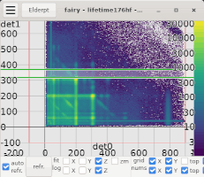
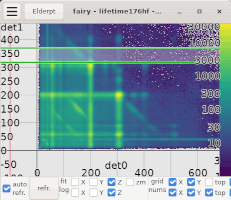
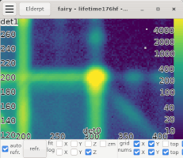
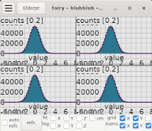

# FAIRY - Flexible Analysis of Ionizing Radiation Yields

This is fairy, a software tool for flexible analsysis of ionizing radaition yields in 1D or 2D spectra of experimental nuclear physics or other data. It is meant to be used with the [Elder](https://git.gsi.de/eel-software/elder/elderpt) data analysis framework.

Fairy is free software, you can redistribute it and/or modify it under the terms of the GNU General Public License.

The GNU General Public License does not permit this software to be redistributed in proprietary programs.

This software is distributed in the hope that it will be useful, but WITHOUT ANY WARRANTY; without even the implied warranty of MERCHANTABILITY or FITNESS FOR A PARTICULAR PURPOSE.

## Design goals

The Design goals of fairy were:
  - quick response in interactive use 
  - fast update rates
  - intuitive interface
  - few dependencies (e.g. fairy does not use Root)

Features are:
  - 1D/2D histograms 
  - 1D/2D window gates and 2D polygon gates
  - 1D functions and interactive fitting to histogram data
  - interactive projections of 2D histograms

The program is written in the D programming language. The GUI is currently based on GTK3 and Cairo.

## User Manual

fairy manages multiple data windows. Each window is separated into 
  - a tree-view of all available items, 
  - a canvas where items are visualized,
  - and below the canvas is a control panel.

When a check box in the tree-view is clicked, the current status of the item will be shown. 
If the check box is a directory with multiple items, all items will be shown.
If the item is a histogram which is changing because data is analyzed, the canvas will show the state of the histogram when the check box was clicked.
Pressing the "refr." button in the control panel will update the drawing of the histogram once.
In "auto refr." mode, the drawing of all items will be updated repeatedly as fast as possible.


Each window can display data (1D/2D histograms, 1D/2D gates, 1D functions) in tree modes
 - overlay mode: all data is drawn on top of each other
 - row-major mode: dat


### mouse navigation in canvas
| translation            | demo animation                               | description |
|------------------------|----------------------------------------------|-------------|
| translation            |      | Translations can be done by click and hold on the canvas with the middle mouse button. Moving the mouse while holding the middle mouse button down will keep the clicked point under the mouse cursor, even if the mouse leaves the window.|
| scaling                |            | By click and hold the canvas with the right mouse button the canvas can be scaled around the point that was clicked. Moving the mouse while hoding the right mouse button will keep the clicked point at a fixed position. Moving the in the x-axis to the left/right while hodling the right mouse button down will zoom/unzoom in x-direction around the clicked point unless "x-fit" mode is active. Moving the in the y-axis up/down while hodling the right mouse button down will zoom/unzoom in y-direction around the clicked point unless "y-fit" mode is active.   |
| color bar manipulation |  | Color bar translation and zoom work in exactly the same way as the for the x- and y-axis with middle and right mouse buttons, only the click point has to be within the color bar.   |
| tiling mode            |  | In tiling mode, the canvas navigation with the mouse works exactly the same as with one item or in overlay mode. All tiles share the same boundaries unless "x-fit" mode or "y-fit" mode are acitve. If "x-fit" mode is active each tile will scale and translate the x-axis such that the x-bounding-box of the item is fully contained. If "y-fit" mode is active each tile will scale and translate the y-axis such that the y-bounding-box of the item is fully contained. If "z-fit" mode is active each tile will scale and translate the color bar such that the z-bounding-box of the item is fully covered by the colorbar. |


### interactive items
Interactive items (1D-windows, 2D-windows, polygon gates) can be manipulated with the left mouse button. 
Elements of interactive items are 
 - left/right border of a 1D-Window
 - points of a polygon gate

Hovering the mouse over an element of an interactive item will highligh that element in green.
A single left click on an element of an interactive item will select only that element and deselect all previously selected elements.
A single left click into the void will deselect all selected elelments.
Holding Ctrl while left clicking an unselected/selected element will add/remove that element to/from the set of selected elements.
Left click and hold will open a selection box. When releasing the left mouse button, all elements inside the box will be added/removed to/from the set of selected elelments if the Shift key is inactive/pressed. 
Click and hold any highlighted or selected element will allow to move all highlighted and selected elements together with the mouse unless a selected element is in a different tile in grid mode then where the mouse click happened.
If elments of different items should be moved together, this must be done in overlay mode.

#### polygon gates

Polygon gates have a richer set of actions than 1D/2D-windows.
 - Line segments can be split by left click on the line while the Shift key is pressed. 
 - A point can be deleted by left click on the point while the Shift key is pressed.
 - The entire polygon can be scaled/rotated around its center by a left click an hold into the polygon area while the Shift/Ctrl key is pressed.

#### interactive function fitting

A `function` item is a 1D formula (e.g. a peak shape on top of a background) with parameters that can be fit to the data of a 1D histogram over some region, and that can additionally expose some of its parameters as draggable "handles" on the canvas, so that the start parameters of the fit can be adjusted interactively with the mouse instead of by editing numbers.

##### quickest way to get started: the right-click menu

Right-click on a 1D-histogram in the item tree-view and choose "chi^2 fit" (or "log-L fit" for a log-likelihood/Poisson fit instead of a chi-square fit), then pick one of the predefined peak shapes ("gauss linear-bg", "cauchy linear-bg", "two gaussians linear-bg", "gauss quadratic-bg", "gaussian-folded exponential linear-bg", "gauss with exponential tail linear-bg"). This automatically creates and shows
 - a 1D-window gate that marks the region used for the fit (its left/right border can be dragged like any other 1D-window, see above), and
 - a function item with handles already placed at reasonable start values, derived from the currently visible part of the canvas.

From there, just drag the handles onto the peak you want to fit (see below), then let go of the mouse to fit.
Holding Ctrl while dragging will continuously run a quick (20-step) fit so you can see a live preview of the fit result as you adjust the handles; releasing the mouse button always triggers a full fit over the gate's region.

##### creating a function by hand with the `funct` command

The same thing can be done by typing a command (in the command line interface, or into a session file). The relevant commands are:
```
gate1d   <gatename> <left> <right>
funct    <name> <definition> <parameters> <handles> <hist1dname> <gate1dname> <results> <dragupdate> <loglikelihood>
show     <gatename> <windowname>
show     <name> <windowname>
```
 - `<definition>` is the function formula as a string, using `x` for the independent variable and any other identifier as a fit parameter. Built-in helper functions include `gauss(x,s)`, `cauchy(x,s)` (a Lorentz/Cauchy peak), `gex(x,s,t)` (a Gaussian folded with an exponential tail of decay constant `t`), `erf`, `erfc`, `step`, `window`, `triangle` and `atan2`. Dividing by e.g. `gauss(s,s)` normalizes the peak so that the parameter in front of it (`A` below) is directly the peak area, not its height.
 - `<parameters>` is a list of `"name=startvalue"` strings for every parameter in `<definition>` except `x`, e.g. `["A=100","s=5","x0=50","a=2"]`.
 - `<handles>` is the handle-tree string described below.
 - `<hist1dname>`/`<gate1dname>` name the histogram to fit and the 1D-window gate that defines the fit region.
 - `<results>` is a list of `"name=expression"` strings, derived quantities (and their errors, propagated from the fit's covariance matrix) that are displayed next to the function after fitting, e.g. `["area=A/gauss(s,s)","FWHM=s*2.35482"]`. The special name `binwidth` can be used inside a result expression to get the histogram's bin width (handy for turning a peak area into a count rate).
 - `<dragupdate>` and `<loglikelihood>` are `true`/`false`; `loglikelihood` selects a Poisson-deviance fit (good for low-statistics histograms) instead of the default chi-square fit.

##### handle syntax: draggable points tied to parameters

A handle string is a sequence of nodes `[paramX,paramY]`, where `paramX`/`paramY` are two parameter names from `<definition>`. Each node becomes one draggable point on the canvas. A node can be followed by `(...)` containing child nodes, which nests their handles as *children* of it; several `[...]` nodes next to each other (not nested) are independent *siblings*.

The position of a root node's handle is simply the value of its two parameters, in canvas (world) coordinates - e.g. `[x0,a]` sits at the point `(x0, a)`, so `x0` and `a` are naturally "global" quantities such as a peak position and a baseline height. A child node's handle, however, is drawn and dragged *relative to its parent*: its canvas position is the parent's position plus its own two parameter values. So a child node `[s,A]` nested under `[x0,a]` is drawn at `(x0+s, a+A)` - which conveniently places the handle for a peak's width/amplitude right on the slope of the peak, next to the peak position/baseline handle it is anchored to.

This has two practical consequences:
 - Dragging a parent handle drags the whole subtree with it (the peak position moves, and its width/amplitude handle moves along, keeping their offsets, i.e. the peak keeps its shape while you reposition it).
 - Dragging a child handle on its own only changes that child's own parameters (e.g. only the width/amplitude), leaving the parent (e.g. the peak position) untouched.
 - Siblings (nodes not nested inside one another) move completely independently of each other.

##### command line fitting

You can fit without using the mouse at all with the `fit` (chi-square) or `fitLL` (log-likelihood) commands, giving the function name, histogram name, and a left/right fit region directly.

###### example: the simplest possible handle, a one-node tree

A straight line `a + b*(x-x0)` has no peak at all, but it is still useful to illustrate the simplest handle tree: a single node with no children, `[x0,a]`. Dragging it left/right changes `x0` (just a reference point on the x-axis), dragging it up/down changes `a` (the line's height at `x0`); `b` (the slope) has no handle here and would be found purely by the fit, or set with a separate `funct` command for a line with no draggable handles at all.

###### example: a Gaussian peak on a sloped background (one root, one child)

```
gate1d peak/gate 40 60
funct  peak/function "A*gauss(x-x0,s)/gauss(s,s)+a+b*(x-x0)" ["A=100","s=5","x0=50","a=2","b=0"] "[x0,a]([s,A])" peak peak/gate ["counts=A/gauss(s,s)/binwidth","area=A/gauss(s,s)","sigma=s","FWHM=s*2.35482","pos=x0"] true false
show   peak/gate win1
show   peak/function win1
```
The root handle `[x0,a]` sits on the peak's position/baseline and can be dragged to reposition the whole peak; its child `[s,A]` sits at `(x0+s, a+A)`, right on the peak's shoulder, and controls the peak's width and amplitude without moving its position. This is exactly the handle tree used by the "gauss linear-bg" menu entry; "cauchy linear-bg" and "gauss quadratic-bg" use the same `[x0,a]([s,A])` tree (the quadratic background's curvature parameter `c` simply has no handle and is left for the fit to determine), and "gauss with exponential tail linear-bg" / "gaussian-folded exponential linear-bg" use the same idea with an extra sibling child, e.g. `[x0,a]([s,A][t,B])`.

###### example: two Gaussian peaks, the second peak's position relative to the first

```
gate1d  peak/gate  30 90
funct   peak/function "A*gauss(x-x0,s0)/gauss(s0,s0)+B*gauss(x-x1-x0,s1)/gauss(s1,s1)+a+(x-x0)*b/x1" ["A=100","s0=5","x0=40","B=80","s1=5","x1=25","a=2","b=0"] "[x0,a]([s0,A][x1,b]([s1,B]))" peak peak/gate ["counts0=A/gauss(s0,s0)/binwidth","counts1=B/gauss(s1,s1)/binwidth","sigma0=s0","sigma1=s1","pos0=x0","pos1=x0+x1"] true false
show    peak/gate  win1
show    peak/function win1
```
Here `x1` is deliberately the *distance* between the two peaks, not an absolute position, and its handle `[x1,b]` is nested under the first peak's `[x0,a]`, with the second peak's own width/amplitude `[s1,B]` nested one level deeper still. Dragging the first peak's root handle moves both peaks together (handy once you've roughly placed the doublet); dragging the second peak's `[x1,b]` handle only changes the gap between the two peaks; dragging the deepest `[s1,B]` handle only changes the second peak's shape. This is the handle tree used by the "two gaussians linear-bg" menu entry.

###### example: two independent peaks (siblings instead of nesting)

If two peaks should *not* be tied together, use two sibling root nodes instead of nesting one under the other:
```
funct doublet/function "A*gauss(x-x0,s0)/gauss(s0,s0)+a + B*gauss(x-x1,s1)/gauss(s1,s1)+b" ["A=100","s0=5","x0=40","a=2","B=80","s1=5","x1=65","b=2"] "[x0,a]([s0,A])[x1,b]([s1,B])" doublet doublet/gate [] true false
```
Now `[x0,a]` and `[x1,b]` are two separate root handles, each with its own child for width/amplitude, and each with its own independent baseline (`a` and `b`). Dragging either peak's handles never moves the other peak - useful when the two peaks don't belong to the same physical doublet and may need to be repositioned independently.


## keyboard shortcuts

| key      | action                                                                        |
|----------|-------------------------------------------------------------------------------|
| Ctrl-n   | open new window                                                               |
| Ctrl-w   | close window                                                                  |
| Ctrl-q   | quit program                                                                  |
|   u      | update content                                                                |
|   p      | toggle poll mode (aka auto update)                                            |
|   f      | fit viewport to content                                                       |
|   x      | toggle auto fit mode on x axis                                                |
|   y      | toggle auto fit mode on y axis                                                |
|   z      | toggle auto fit mode on z axis                                                |
|   l      | toggle logscale mode (affects y or z axis)                                    |
|   g      | toggle grid                                                                   |
|   i      | toggle fill mode for 1D histograms                                            |
|   t      | toggle statistics display for 1D histograms                                   |
|   m      | toggle zoom mode (only filled bins are considered when fitting the viewport)  |
|   o      | overlay mode (no tiling, all histograms are drawn on top of each other)       |
|   r      | row-major mode                                                                |
|   c      | column-major mode                                                             |
| 1...9    | set number of rows/columns in row-/column-major mode                          |
|   b      | toggle color bar                                                              |
| a,s,d,w  | navigate the viewport                                                         |
|  e,q     | zoom in/out                                                                   |
